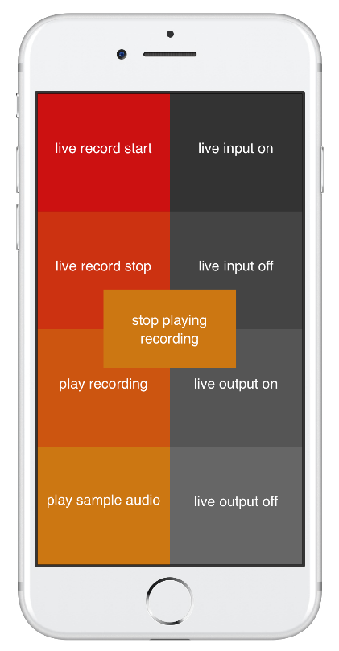
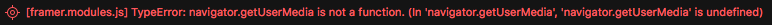

# AudioAccess-framer
A module for FramerJS that enables microphone input and recording inside Framer prototypes.



# Acknowledgements
This module exposes and simplifies the use of two technologies:
- __RecorderJS by Matt Diamond__ [https://github.com/mattdiamond/Recorderjs](https://github.com/mattdiamond/Recorderjs)
- __Web Audio API__ this is a new HTML5 API that can be used to load and play audio files, or generate sounds using oscillators and other cool audio tools. See [https://developer.mozilla.org/en-US/docs/Web/API/Web_Audio_API](https://developer.mozilla.org/en-US/docs/Web/API/Web_Audio_API) for details

# Before you use
__Platform support__
As of _10th January 2017_, Framer Studio for macOS uses Safari as its rendering engine. Safari on all platforms does not support the HTML5 API ``getUserMedia``. Given this, this module will cause an error inside Framer Studio related to ``getUserMedia``. You can safely ignore it:


__Prerequisites for use__
Because of the lack of widespread support for the ``getUserMedia`` API, and Google Chrome's insistance that the API call be made from a secure host, I can only guarantee this module works if:

1. You use >= ``Chrome 49`` or ``Firefox >=50``
2. You load the Framer prototype from ``127.0.0.1``, ``localhost``, or Framer cloud with ``https://..``

# Installation
1. Put the ``node_modules`` folder inside your Framer JS prototype's folder
2. Copy ``npm.coffee`` to the ``modules`` folder
3. Copy ``AudioAccess.coffee`` to the ``modules`` folder

_N.B._ It's a good idea to copy the files in this order. I've had problems with Framer Studio not recognising the modules in the ``node_modules`` folder, even in a brand new prototype, unless the folder is present before I load in ``npm.coffee``

#Usage
## Init
1. To use the module, first require it. Note the curly braces - they are required:
```
{ AudioAccess } = require 'AudioAccess'
```
2. Create a new AudioAccess object
```
AudioAccess = new AudioAccess
```
where the name of the object can be any friendly name you want to use.

## Methods
There are a number of methods available to you to control the Audio API and recording functionality. Attach the behaviour to buttons or even call them programatically:

#### Live microphone input
To connect your input::
```
AudioAccess.attachLiveInput()
```
To disconnect your input:
```
AudioAccess.detachLiveInput()
```
#### Record live input
Once you've connected your input, you can start recording:
```
AudioAccess.recordInput()
```
When you're recording is over, stop recording with: 
```
AudioAccess.stopRecordingInput()
```
NOTE: ``stopRecordingInput()`` will store your recording ready for playback after recording. When the module has finished storing your recording, it will call a callback function called ``recordingCB``. Assign a function to this callback to trigger something once your recording is confirmed. Example: 
```
# callback for when recording has finished being saved
AudioAccess.recordingCB = () ->
  # do something after successful recording

aButton.on Events.Click, ->
  #AudioAccess.recordingCB will fire after stopRecordingInput completes successfully
  AudioAccess.stopRecordingInput()
```

### Live output to speaker / headphones
You might want to pump the output of the live input to headphones, for monitor like behaviour. To connect the live output:
```
AudioAccess.attachLiveOutput()
```
To disconnect live output:
```
AudioAccess.detachLiveOutput()
```
To set the volume of the live output (a value between 0 and 1):
```
AudioAccess.setOutputVolume(value)
```

### Playing back recording
You can play back the last recording:
```
AudioAccess.playLastRecording()
```
You can stop the last recording:
```
AudioAccess.stopPlayLastRecording()
```
NOTE: When the module has finished playing the last recording (or you manually stop it), it will call a callback function called ``playRecordingCB``. If you set a function to this callback, then you can trigger behaviour when the playback ends. *Example*:
```
# callback for when recording has finished playing
AudioAccess.playRecordingCB = () ->
  # do something cool after playback ends

playButton.on Events.Click, ->
  #AudioAccess.playRecordingCB will fire after playLastRecording completes successfully
  AudioAccess.playLastRecording()

stopButton.on Events.Click, ->
  #AudioAccess.playRecordingCB will fire after playLastRecording completes successfully
  AudioAccess.stopPlayLastRecording()
```

### Extracting recording for later use
You can get the last recording using ``getLastRecording()`` and store it in whatever way you want. For example, storing a recording in an array:
```
allRecordings = []
allRecordings.push(getLastRecording())
#do some other cool stuff
```

### Loading an old recording
If you've extracted and stored the recording in your own data structure, put it back into AudioAccess using ``setLastRecording()``:
```
# load audio ready for user to play back
AudioAccess.setLastRecording(allRecordings[0])
```

### Audio files
You can put audio files into your prototype using this set of functions. Each function takes a callback as an argument. This will fire when each action has ended (load, playback, stop):
#### Load audio file
To load an audio file call ``loadAudioFile(filePath,callback)``, provide a path (inside your Framer prototype) and a callback that will fire on successful load:
```
AudioAccess.loadAudioFile('audios/example.mp3', () -> layerA.image = 'loaded.png')
```
#### Play back an audio file
To play the audio file you have loaded, call ``playAudioFile(callback)``. Provide a callback that will play when the file ends.
```
AudioAccess.playAudioFile( () -> layerA.image = 'playing.png')
```
#### Stop an audio file from playing
To stop a playing audio, call ``stopAudioFile(callback)``. Provide a callback that will play when the file ends.
```
  AudioAccess.stopAudioFile( () -> layerA.image = 'stopped.png')
```
